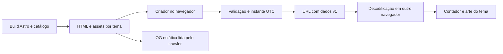
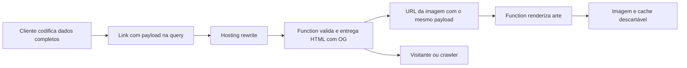

# Arquitetura e evolução

Contrato técnico para CAP-1 a CAP-9. Decisões de detalhe A2–A4/A7/A10–A14 são propostas do MVP; o roteiro Firebase não autoriza implementação nesta etapa.

## Estado atual e reaproveitamento

`index.html` concentra layout, três datas fixas, jQuery 1.10.2 via CDN, canvas-confetti 1.9.2 e FlipClock local em `compiled/`. A imagem OG atual é remota e única. Não há estrutura Astro ou package.json no inventário inspecionado.

Migrar para Astro com componentes de layout, formulário, relógio, ações e slot publicitário. Verificar licença, versão, compatibilidade e manutenção das dependências antes de fixá-las. jQuery/FlipClock são candidatos: isolá-los no renderer se mantidos, sem contaminar codec ou cálculo temporal. Se o relógio antigo falhar em responsividade, acessibilidade ou testes, substituir o renderer preservando a apresentação flip quando viável. canvas-confetti fica isolado e condicionado às preferências de movimento. Não perpetuar CDN antigo por conveniência.

## Estrutura e rotas

Astro gera páginas no build; esse comportamento é compatível com a saída estática proposta. [Documentação oficial](https://docs.astro.build/en/guides/on-demand-rendering/)

| Caminho | Responsabilidade |
|---|---|
| `/` | Galeria dos quinze temas e explicação do produto |
| `/<tema>/` | Página HTML própria para cada slug permitido; sem fragmento mostra criador, com fragmento válido mostra evento |
| `/privacidade/` | Informação do operador e tratamento real de dados; fechar Q3 antes da ativação comercial |
| `/404.html` | Página de erro entregue com status 404 pelo host; não usar fallback universal para rotas inexistentes |
| `/og/<tema>.png` | Arte estática por tema; extensão final pode ser JPG e deve corresponder ao metadado |

Um registry tipado de quinze temas alimenta rotas, galeria, tokens visuais e OG. Componentes consomem esse registry; não duplicar regras por tema. Separar módulos `theme-search`, `event-codec`, `event-validation`, `event-time`, `countdown-renderer`, `share`, `calendar-export`, `event-map`, `directions`, `ads` e `metrics`; núcleo de evento testável sem DOM. Conteúdo estático útil permanece disponível sem JavaScript.

## Busca local do catálogo

Gerar nomes/aliases/categorias junto ao registry no build. O navegador normaliza consulta e índice e filtra a lista local; não pesquisar eventos, não baixar serviço de sinônimos e não transmitir a consulta. Manter cards e links no HTML estático como fallback. A especificação determinística de correspondência e exemplos está em `busca-de-temas.md`.

## Contrato do link v1

```text
/<tema>/#v=1&dados=<Base64URL sem padding de JSON UTF-8>
```

```json
{
  "title": "Aniversário da Ana",
  "endAt": "2027-06-12T21:00:00.000Z",
  "timeZone": "America/Sao_Paulo",
  "message": "Vamos comemorar juntos!",
  "organizer": "Família da Ana",
  "venue": "Salão de festas",
  "address": "Rua Exemplo, 123\nSão Paulo — SP"
}
```

O exemplo é ilustrativo, não um evento padrão. O tema vem exclusivamente do caminho; o objeto não repete esse campo. MD5 não é codificação reversível e não permitiria reconstruir o evento sem lookup. Base64URL também não cifra dados.

| Campo/regra | Validação proposta |
|---|---|
| `v` | Exatamente `1`; ausente ou desconhecida com fragmento presente é erro |
| `title` | String, trim/NFC, de 1 a 80 pontos de código Unicode |
| `message` | String, trim/NFC, de 0 a 240 pontos de código; sempre serializada, inclusive vazia |
| `endAt` | Instante válido e canônico `YYYY-MM-DDTHH:mm:00.000Z`, anos 2000–2100; deve round-trip sem normalização de datas impossíveis |
| `timeZone` | Identificador IANA suportado, até 64 caracteres; validar com mecanismo de fuso |
| `organizer` | String opcional, trim/NFC, até 60 pontos de código; anfitrião ou organização |
| `venue` | String opcional, trim/NFC, até 80 pontos de código; nome do local |
| `address` | String opcional, trim/NFC, até 200 pontos de código; endereço livre com quebras de linha seguras |
| `calendarEndsAt` | Instante UTC canônico opcional, anos 2000–2100, estritamente posterior a `endAt`; fim do compromisso na agenda |
| `location` | Objeto opcional `{lat, lon}` finito e validado; contrato em mapas-e-rotas.md |
| `meetingUrl` | URL HTTPS absoluta opcional até 1024 caracteres, sem credenciais; não carregar nem executar automaticamente |
| Objeto | Quatro chaves originais obrigatórias e seis opcionais conhecidas, tipos estritos; sem URLs de assets, HTML ou campos de execução |
| Tamanho | URL completa até 4096 caracteres; JSON decodificado até 3072 bytes; verificar tamanho antes de alocar/parsear |
| Fragmento | Exatamente `v` e `dados`, sem parâmetros duplicados; Base64URL/UTF-8/JSON válidos; demais estruturas são inválidas |

Serialização na ordem `title`, `endAt`, `timeZone`, `message`, `organizer`, `venue`, `address`, `calendarEndsAt`, `location`, `meetingUrl`, omitindo opcionais vazias; JSON sem espaços; normalização de texto igual no emissor e receptor. Links v1 antigos sem as chaves opcionais continuam válidos, interpretados como detalhes vazios e término do compromisso não informado e destino ainda não confirmado no mapa. Medir bytes e tamanho da URL completa após codificar; se ultrapassar os limites, pedir redução de texto sem truncar. Não aplicar `btoa` diretamente a Unicode. Texto é inserido como texto, nunca `innerHTML`; nenhum dado do evento escolhe script ou asset; a única URL externa fornecida pelo usuário é `meetingUrl`, validada e aberta apenas por ação explícita, sem fetch/iframe.

Sem fragmento: criador. Fragmento inválido: erro recuperável, nunca evento de exemplo silencioso. Decodificador aceita eventos passados; criador exige instante futuro no momento de gerar. Editar copia os dados e gera outra URL; links antigos não mudam. Não usar armazenamento local como fonte necessária para abrir um link.

O fragmento não é enviado ao servidor na requisição HTTP, o que permite servir o mesmo HTML do tema. Isso não o protege de quem recebe o link nem de scripts executados na página. [MDN: fragmentos de URI](https://developer.mozilla.org/en-US/docs/Web/URI/Reference/Fragment)

## Importar, duplicar e personalizar um link

Expor “Duplicar a partir de um link” na home e no criador e “Duplicar e personalizar” no evento. Qualquer visitante pode usar essas ações, sem proprietário, segredo de edição, login ou autorização do criador. Aceitar URL absoluta ou caminho do próprio site; permitir apenas origem atual ou origem de produção configurada, base path correto e slug conhecido. Rejeitar URLs com credenciais, outros esquemas/domínios ou payload inválido. Fazer parse/validação no navegador sem fetch, navegação ou consulta de eventos.

Preencher todos os campos incluindo os opcionais e permitir revisão. Manter formulário anterior se a importação falhar. Importar um evento vencido é válido, mas gerar novo link exige data futura. Compartilhar a versão alterada é responsabilidade da pessoa: links previamente enviados não recebem atualizações e não podem ser revogados sem backend.

## Instante, fuso e relógio

Converter data/hora local + fuso IANA em um instante UTC. Rejeitar horários inexistentes ou ambíguos e pedir uma escolha não ambígua; não assumir que `new Date(campoLocal)` usa o fuso selecionado. Mudanças de horário podem gerar lacunas e duplicidades; a implementação deve ter comportamento equivalente a rejeitá-las, sem impor uma biblioteca ainda não avaliada. [MDN: ZonedDateTime](https://developer.mozilla.org/en-US/docs/Web/JavaScript/Reference/Global_Objects/Temporal/ZonedDateTime)

Calcular `remainingSeconds = max(0, ceil((endAtMs - Date.now()) / 1000))` e decompor em dias/horas/minutos/segundos. Timer apenas provoca novo cálculo; não manter contagem por decrementos acumulados. Recalcular em `visibilitychange` e ao retomar execução. A exibição usa o fuso do evento; o instante UTC continua sendo autoridade após compartilhar, mesmo se regras do fuso mudarem.

O MVP depende do relógio do dispositivo e não consulta servidor de hora. Eventos não são recorrentes. Zero é terminal para o evento; não saltar para o próximo ano. Animação não controla o cálculo temporal.

## Mapa e direções

O grupo Local é opcional para todo tema. Novos links com `venue` ou `address` exigem ponto confirmado `location`; o decoder preserva compatibilidade com texto sem ponto em links antigos. O módulo de mapa usa coordenadas do payload, sem consultar uma base de eventos nem geocodificar toda visita. A origem do visitante fica só em memória para a ação de direções.

Tiles/geocodificação são serviços externos configuráveis, separados da hospedagem e da lógica de eventos. Nunca embutir segredo de API. Contrato de seleção do ponto, permissões, limite dos provedores e falhas em `mapas-e-rotas.md`.

## Exportação de calendário

`endAt` mantém o nome legado: fim da contagem e início do evento. `calendarEndsAt` é o fim opcional do compromisso; nunca usar `endAt` como DTEND da agenda. Formulário e importação validam a relação entre ambos; duplicação preserva o campo opcional e não ajusta duração silenciosamente.

Gerar ICS/atalhos no navegador, sem SDK de conta, OAuth, tokens ou banco. O módulo recebe somente o evento validado e sua URL completa; mapeamento, formato e compatibilidade estão em `calendarios.md`. O núcleo de contador não depende do módulo de exportação. As mesmas regras de escape, limites, texto seguro e encaminhamento explícito valem para payloads do futuro Firebase.

## Reunião online e texto de convite

`meetingUrl` vazio é omitido; preenchido deve ser URL HTTPS absoluta válida, com hostname e sem credenciais. Limite de 1024 caracteres e limites agregados da URL/payload são aplicados sem truncamento. Não transformar texto da mensagem em URL executável. Abrir o link de reunião por ação explícita com `noopener`/`noreferrer`, mostrando o domínio; sem buscar preview, criar conferência, usar OAuth ou confirmar legitimidade de site externo.

Montar convite textual localmente com os campos preenchidos e URL integral do evento. Escape para o destino de compartilhamento quando necessário; não modificar o fragmento nem reduzir conteúdo silenciosamente. Clipboard tem fallback manual; métricas não recebem reunião, convite ou URL. O calendário inclui a reunião como texto/link na descrição, sem criar dados de conferência na conta.

## Compartilhamento e metadados

`navigator.share` é melhoria progressiva; copiar com Clipboard API quando permitido e campo selecionável como fallback. Registrar sucesso apenas após retorno apropriado; compartilhar com sucesso não comprova leitura pelo destinatário. Testar se o canal escolhido preserva o fragmento.

No build, cada tema recebe `title`, description, `og:title`, `og:description`, `og:type=website`, `og:url`, `og:image`, dimensões/alt e canonical com origem absoluta configurada. `og:url` e canonical identificam a página do tema, sem fragmento. A OG usa somente nome/arte do tema. Tags pertencem ao HTML entregue; alterar DOM no navegador não é solução para prévia social. [Protocolo Open Graph](https://ogp.me/)

Domínio/base path são configuração do build e dependem de Q2. Testar HTML sem JavaScript e fetch público da imagem; previews externas podem manter cache. O evento personalizado não é página individual indexável no MVP; páginas de tema são o ponto de descoberta.

## Fluxo do MVP



## Evolução futura: OG por evento com Firebase, sem banco

Uma Function que retorna PNG não resolve sozinha a prévia individual: o HTML compartilhado precisa referenciar a imagem daquele evento. Firebase Hosting pode encaminhar caminhos para Functions via rewrites. [Configuração oficial](https://firebase.google.com/docs/hosting/full-config)

Manter o contrato sem base de dados também nesta evolução. Proposta fora do MVP:

1. A pessoa escolhe uma prévia personalizada e o cliente produz `/e/<tema>/?v=1&dados=<payload>` com os dados completos. Nenhuma API de criação/gravação é necessária; não substituir o payload por um identificador que exija lookup.
2. Hosting encaminha `/e/<tema>/` à Function de HTML. A função valida rota, versão, tamanho e todos os campos usando o mesmo contrato, e entrega HTML completo com evento e metadados específicos, igual para visitantes e crawlers.
3. `og:image` aponta para `/og-event/<tema>.png?v=1&dados=<payload>`. A Function de imagem valida a mesma carga e renderiza usando somente fontes/assets controlados. Escape de atributos no HTML é obrigatório; nenhuma URL do usuário é buscada.
4. Cache de arte derivada pode usar `SHA-256(payload canônico + tema + versão da arte)`, mas o hash nunca substitui os dados necessários para reconstruir o evento. Cache é descartável; apagar o cache não quebra a resolução do link. Não adicionar Firestore ou cadastro persistente de eventos.
5. O HTML precisa usar URL absoluta do evento com query para sua identidade social; a imagem usa versão do renderer nos parâmetros/chave de cache. Em falha de imagem, servir a arte estática do tema como fallback. Payload/tema inválido recebe erro recuperável com status apropriado, sem imagem personalizada nem gravação.
6. Links `#v=1` permanecem no cliente com OG genérica. Converter é opcional e gera outro link: o servidor nunca recebe o fragmento original por HTTP.

Isso mantém ausência de banco, mas o sistema completo deixa de ser inteiramente estático porque HTML/arte personalizados passam por Functions. Dados em query podem aparecer em logs e ferramentas externas; avaliar logs, referrers e retenção de caches antes de ativar, sem prometer sigilo. Endereço e demais campos continuam públicos para quem possui o link.

Antes de implementar: confirmar projeto/região/plano Firebase, custo/cotas, controle de abuso, política de conteúdo e comportamento do cache. Não definir orçamento sem uso esperado. Sem encurtador, edição remota, revogação, banco de eventos ou migração automática; editar sempre gera outra URL. A compatibilidade do esquema deve ser compartilhada entre navegador e Functions.


